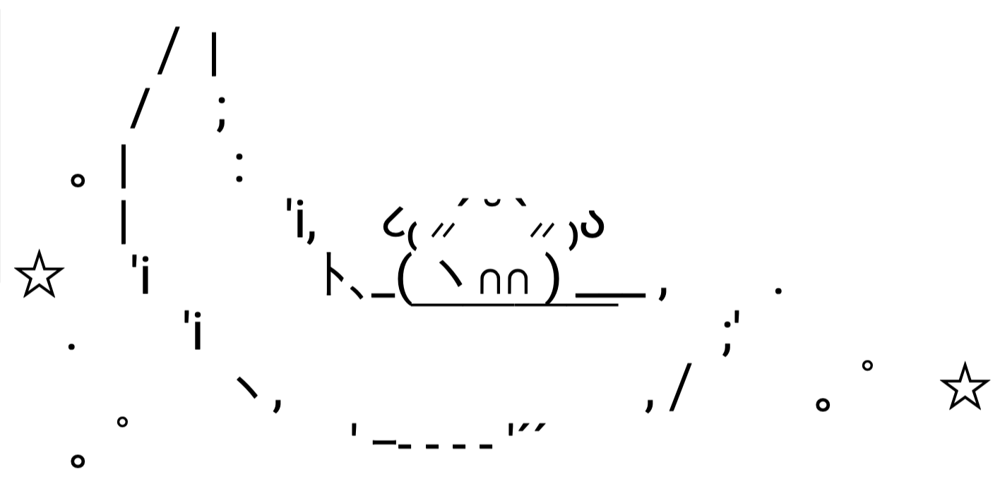

  <em><strong>hi there!</strong></em>
\
i'm a 4th year computing science student @ glasgow university

malware enthusiast  
currently trying to get better at binary exploitation <em>(for ctf purposes)</em>

connect with me ￬

  

